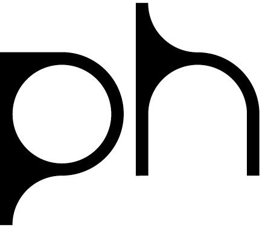
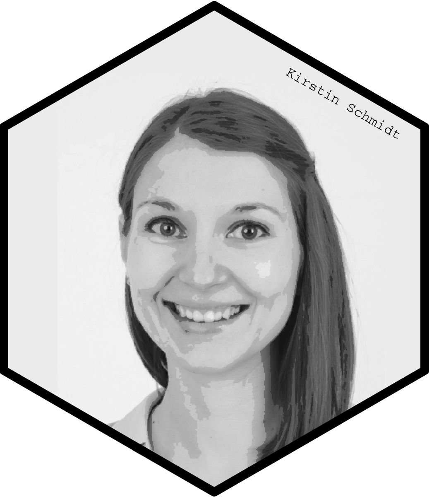
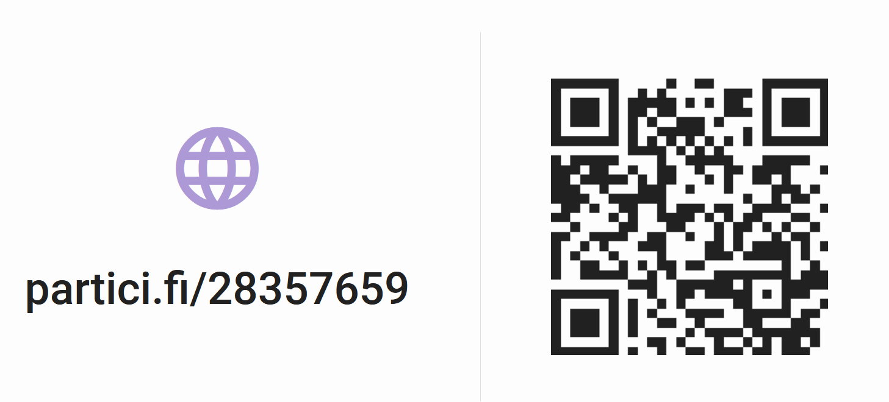
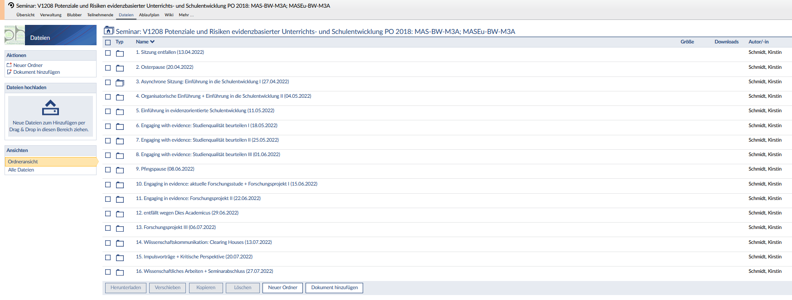

---

title: "Organisatorische Einführung in das Seminar"
output:
  xaringan::moon_reader:
    css: xaringan-themer.css
    lib_dir: libs
    seal: false
    nature:
      highlightStyle: github
      highlightLines: true
      countIncrementalSlides: false
      ratio: "16:10"
---
layout: true
background-image: url(https://live.staticflickr.com/65535/50973602108_8fce3f8f28_k.jpg)
background-size: cover

---
name: title
class: center, middle, hide_logo

```{r, eval=FALSE, echo = F}
dir.create("style_file")
```

```{r xaringen-themer,echo=F, warning=FALSE, message=FALSE}
#install.packages("xaringan")
#install.packages("xaringanthemer")
#library(xaringanthemer)
#style_mono_light(
#  base_color = "#001c05",
#  header_font_google = google_font("Times New Roman"),
#  text_font_google   = google_font("Times New Roman", "300", "300i"),
#  code_font_google   = google_font("Fira Mono")
#)

#colors = c(
#  red = "#f34213",
#  purple = "#3e2f5b",
#  orange = "#ff8811",
#  green = "#136f63"
#)

library(xaringanthemer)
#devtools::install_github("gadenbuie/xaringanExtra")
library(xaringanExtra)
library(readxl)
library(tidyverse)
library(ggalt)
library(hrbrthemes)
library(reactable)
htmltools::tagList(rmarkdown::html_dependency_font_awesome()) 

extra_css <- list(
  ".cit"  = list("font-size" = "70%",
                 "color" = "#6AEE3E90"),
  ".em05" = list("font-size" ="0.5em"),
  ".em06" = list("font-size" ="0.6em"),
  ".em07" = list("font-size" ="0.7em"),
  ".em08" = list("font-size" ="0.8em"),
  ".em09" = list("font-size" ="0.9em"),
  ".em11" = list("font-size" ="1.1em"),
  ".em12" = list("font-size" ="1.2em"),
  ".em13" = list("font-size" ="1.3em"),
  ".em14" = list("font-size" ="1.4em"),
  ".em15" = list("font-size" ="1.5em"),
  ".bold" = list("font-weight" = "bold"),
  ".medium" = list("font-size" = "130%"),
  ".large" = list("font-size" = "160%"),
  ".vertmiddle" = list("vertical-align" ="middle"),
  ".lh15" = list("line-height" =  "1.5"),
  ".lh16" = list("line-height" =  "1.6"),
  ".lh18" = list("line-height" =  "1.8"),
  ".li" = list("line-height" =  "1.5",
               "font-size" = "160%",
               "font-weight" = "bold"),
  ".phgreen" = list("color" = "#50B32E"),
  ".phgreenlight" = list("color" = "#62DC3A"),
  ".lightgrey" = list("color" ="#b3b3b3"),
  ".my-footer" = list("background-color" = "#1a1917",
                      "position" = "absolute",
                      "bottom" = "0px",
                      "left" = "0px",
                      "height" = "20px",
                      "width" = "100%"),
  ".my-footer span" = list("font-size" = "10pt", 
                           "color" = "#F7F8FA",
                           "position" = "absolute",
                           "left" = "15px",
                           "bottom" = "2px"),
  ".remark-slide-number" = list("bottom" = "18px"),
  ".li" = list("line-height" =  "4"),
  ".scroll-box-18" = list("height" ="18em",
                           "overflow-y" = "scroll"),
  ".scroll-box-23" = list("height" ="23em",
                           "overflow-y" = "scroll"))

style_mono_accent(
  text_color = "#ffffff",
  base_color           = "#ffffff",
  header_font_google   = google_font("Roboto", "700"),
  text_font_google     = google_font("Roboto", "500"),
  code_font_google     = google_font("Droid Mono"),
  extra_css = extra_css,
  inverse_background_color = "#ffffff",
  inverse_text_color = "#000000",
  link_color = "#6AEE3E"
)

use_logo(
  image_url = "https://live.staticflickr.com/65535/50974533397_9ac99f9a48_o.png",
  width = "180px",
  position = css_position(top = "1.5em", right = "1.5em")
)

use_editable(expires = 1)
```

## .phgreen[Evidenzorientierte <br> Unterrichts- und Schulentwicklung]



### .phgreenlight[Organisatorische Einführung - <br> Einführung in Schulentwicklung (II)]


.em14[.white[Institut für Schul- und Unterrichtsentwicklung | 04.05.2022]]  


???


* herzlich willkommen in der ersten Präsenzsitzung
* aufgrund des Ausfalls eine ungewöhnliche Struktur; sie sind schon inhaltlich in die SE eingestiegen, daran knüpfen wir heute nochmal an, bevor wir dann in der zweiten Hälfte des Seminars einen Schritt zurück gehen, um Orga-Sachen zu klären.
* konkret sieht das dann so aus:

---

name: outline

## .phgreen[Was erwartet Sie heute? `r fontawesome::fa_i(name = "list-ol")`] 
  * Vorstellungsrunde `r fontawesome::fa_i(name = "users")`
  * Arbeitsauftrag: Beispiel für gelungene Schulentwicklung `r fontawesome::fa_i(name = "school")`
  * Entscheidungsgrundlagen <i class="fas fa-info"></i>
  * Organisation des Seminars <i class="fas fa-sitemap"></i>
  
  
???


* wir starten mit einer Vorstellungsrunde, dass Sie sich untereinander aber auch mich besser kennenlernen. 
* dann knüpfen wir an der letzten Sitzung an, indem wir näher auf Ihren AA eingehen
* anschließend möchte ich mit Ihnen Entscheidungsgrundlagen sammeln. Also überlegen auf welche Grundlagen man sich beziehen kann, wenn es darum geht z.B. eine Entscheidung im SE-Prozess zu treffen. In den kommenden Sitzungen werden wir uns dann einer konkreten Entscheidungsgrundlage ausführlich widmen - welche das ist möchte ich aber nicht vorweg nehmen, um Sie bei der Sammlung nicht zu beeinflussen 
* im zweite Teil des Seminars werden wir ausführlich auf die Organisation des Seminars eingehen
 + Seminarfahrplan vorstellen, welche CP für welche Leistungen und wo Sie welche Materialien finden können

---
class: inverse, center, middle

# .phgreen[Vorstellungsrunde `r fontawesome::fa_i(name = "users")`]


???


* für die Vorstellungsrunde habe ich mich von Twitter Henrik Bellinghäuser wissenschaftlicher Mitarbeiter an der Uni Mainz in der Abteilung Psychologie in Biwi inspirieren lassen
* keine klassische Vorstellungsrunde machen, sondern mit Ihnen ein Kennenlern-Bingo spielen

---
## .phgreen[Kennenlern-Bingo `r fontawesome::fa_i(name = "users")`]


.center[]

???


* Kennt jemand Bingo nicht?
* Kurz erklären? 
* Fragen stellen, bei Treffer Namen in das Feld eintragen, fünf ausgefüllte Namen in waagerechter, senkrechter oder diagonaler Reihe mit den ermittelten Gewinnzahlen überein, BINGO rufen
* Ergebnisse kurz vorstellen :-)

<!-- 30 Minuten --> 
---

## .phgreen[Eigene Vorstellung ]

* .phgreenlight[2014 - 2017:] Bacherlorstudium der Erziehungswissenschaft (Universität Tübingen)
* .phgreenlight[2017 - 2020:] Masterstudium der Schulforschung und -entwicklung (Universität Tübingen)
* .phgreenlight[seit 2020:] akademische Mitarbeiterin und Doktorandin am Institut für Schul- und Unterrichtsentwicklung
* .phgreenlight[seit 2021:] Mitarbeit in verschiedenen Forschungsprojekten z.B. SQooL.it, KAiAC-T
* .phgreenlight[Forschungsschwerpunkt:] 
  + Umgang von Lehrkräften mit Evidenz
  + Wissenschaftskommunikation
  + empirische Schul- und Unterrichtsforschung
* .phgreenlight[WiSe 2022/2023:] Betreuungskapazitäten für Masterarbeiten 
* .phgreenlight[Sprechstunde]: Vereinbarung per Mail
* .phgreenlight[Kontakt:] <br>
  .em07[<i class="far fa-envelope"></i> kirstin.schmidt@ph-karlsruhe.de <br>]
  .em07[<i class="fas fa-map-marker-alt"></i> Raum 2.B300 <br>]
  .em07[<i class="fas fa-phone"></i> 0721/925-4602 <br>]


???

* dann möchte ich mich natürlich auch noch kurz näher vorstellen
* meine Studienzeit an der Uni TÜ verbracht - erst Erziehungswissenschaft studiert und mich dann im Master auf Bildungswissenschaften mit dem Master Schulforschung und -entwicklung spezialisiert
* mit Start des ersten Lockdowns an die PHKA im April 2020 gekommen
* In SQooL.it geht es im Allgemeinen um den Erwerb informatischer Kompetenzen bei Schüler:innen
* In Kaiac-T geht es um das Eignungsfeststellungsverfahren von Lehramtstudierenden an der PH, das Sie vermutlich selbst durchlaufen haben

---

class: inverse, center, middle

# .phgreen[Arbeitsauftrag: Beispiel für gelungene Schulentwicklung `r fontawesome::fa_i(name = "school")`]

---

## .phgreen[Best Practice Beispiele `r fontawesome::fa_i(name = "school")`]

Partner:innenarbeit `r fontawesome::fa_i(name = "comments")`: 
* Stellen Sie sich gegenseitig Ihre Ergebnisse vor 
* Was nehmen Sie aus der Recherche der Best Practice Beispiele mit (z.B. interessante oder neue Erkenntnisse)?
* Gibt es bestimmte Aspekte, die Sie gerne im Plenum diskutieren würden?
* Gibt es Rückfragen zur letzten Sitzung, die Sie gerne im Plenum klären würden?

.center[.phgreenlight[ca. 15 Minuten]]

Plenum `r fontawesome::fa_i(name = "users")`:
* interessante / neue Erkenntnisse
* Diskussionspunkte
* offene Fragen

.center[.phgreenlight[ca. 10 Minuten]]

???

* in der asynchronen Sitzung haben Sie sich zuerst das Erklärvideo zu SE angeschaut und dann sollten Sie im Deutschen Schulportal ein Best Practice Beispiel recherchieren und dessen Konzept mit Blick auf die theoretischen Merkmale von SE analysieren
* zuerst mit der/dem Tischnachbar:in die Analyse gegenseitig vorstellen, dann besprechen, was Sie besonders interessant fanden und Rückfragen sammeln
* dann im Plenum diese Punkte besprechen
* insgesamt ca. 20 - 25 Minuten

---

class: inverse, center, middle

# .phgreen[Entscheidungsgrundlagen <i class="fas fa-info"></i>]


???

* bisher vor allem fokussiert, wie SE gesteuert und ablaufen kann, welche Akteure involviert sein können, auf welchen Ebenen oder Wegen SE ablaufen kann
* aber wenn wir jetzt uns den Entscheidungsprozess bei Schulentwicklung anschauen, dann kann man sich ja auf ganz unterschiedliche Grundlagen beziehen, um eine Entscheidung zu treffen.


---

```{r xaringan-editable, echo=FALSE}
xaringanExtra::use_editable(expires = 1)
```

## .phgreen[Entscheidungsgrundlagen <i class="fas fa-info"></i>]

Sammeln Sie in Kleingruppen verschiedene Grundlagen, auf die man sich bei Entscheidungen (unbewusst) berufen kann. Denken Sie dabei sowohl an Entscheidungen, die im Schulkontext als auch im Alltag getroffen werden. Wenn möglich, überlegen Sie sich zur Veranschaulichung konkrete Beispiele.

.center[.phgreenlight[max. 4 Personen; ca. 15 Minuten]]


.can-edit.key-likes[
- Intuition / Bauchgefühl Beispiel: digitale Spiele steigern die Motivation von Schüler:innen, da Sie abwechslungsreich sind und Ihnen bestimmt mehr Spaß machen 
- ...
]


???

* Ich frage mich, ob ich in meinem Unterricht mehr digitale Tools einsetzen soll. Z.B. digitale Spiele im Unterricht
* wenn ich jetzt beispielsweise auf auf mein Bauchgefühl höre, dann gehe ich davon aus, dass digitale Spiele abwechslungsreich sind und Spaß machen und daher die Motivation der SuS steigert. Vielleicht haben Sie aber eine ganz andere Intuition und würden sich daher anders entscheiden

* __Autoritätsperson__
  + Man stützt sich auf die Aussagen von Autoritätspersonen bzw. Experten
* __Religion__
* __Tradition__: weiter so machen, wie wir es schon immer gemacht haben und es bei der vermeintlich oder tatsächlich bewährten Vorgehensweise belassen &rarr; das wäre dann lieber keine SE betreiben
  * Überliefertes Wissen früherer Generationen
  + Bsp. seit Generationen wird überliefert, dass man beim Husten und Niesen die Hand vor den Mund halten soll, um andere nicht anzustecken &rarr; niesen in Armbeuge
* __Gesunder Menschenverstand__: geteilte Überzeugung einer Gruppe. Was als „gesunder Menschenverstand“ angesehen wird, variiert zwischen sozialen Gruppen; Überzeugung z.B. zu Geschlechtsunterschieden in Kommunikation
*	__Anekdotische Evidenz__: Eigene Lebenserfahrung („unmittelbar verfügbare Evidenz“) und/oder Beispiele aus dem Umfeld (hierzu zählen Best Practice Beispiele) oder den Medien
* __Daten__ aus Erhebungen (z.B. aus Lernstandserhebungen, internationalen Schulleistungsstudien
* __Wissenschaftliche Erkenntnisse 
* Logik: In sozialen Zusammenhängen handeln Menschen und Organisationen oft nicht logisch oder rational
* __externe Vorgaben__ (Gesetze, Bildungsplan ...)


*	Näher auf Wissenschaftliche Erkenntnisse als Grundlage von Entscheidungen eingehen, da EOSE darauf abzieht wissenschaftliche Erkenntnisse in der Praxis zu berücksichtigen. 
* insgesamt ca. 30 Minuten

---

## .phgreen[Wissenschaftliche Vorkenntnisse `r fontawesome::fa_i(name = "chart-bar")`]



---
class: inverse, center, middle

# .phgreen[Organisation des Seminars <i class="fas fa-sitemap"></i>]


---

## .phgreen[Mit Wissenschaft beschäftigen `r fontawesome::fa_i(name = "microscope")`]

* zu Beginn jeder Seminarsitzung kurzer __.phgreenlight[Austausch über für Sie interessante und / oder neue wissenschaftliche Erkenntnisse]__
  + wissenschaftliche Erkenntnisse __.phgreenlight[unterschiedlicher Disziplinen]__ 
  + wissenschaftliche Erkenntnisse __.phgreenlight[aus unterschiedlichen Quellen]__ (z.B. aus anderen Seminaren, Publikationen, Podcasts)
  + kurze __.phgreenlight[Information direkt im Seminar]__ oder __.phgreenlight[Informationen (wissenschaftliche Erkenntnis und wie Sie über diese erfahren haben) per Mail vorab]__


???

* neue Idee, wir probieren es einfach mal aus, wie es funktioniert
* 5 Minuten zu Beginn des Seminars Zeit nehmen, um uns über neue oder interessante wissenschaftliche Befunde auszutauschen, denen Sie in der Woche begegnet sind. Das können Befunde aus ganz unterschiedlichen Disziplinen sein.
* keine Sorge, kann ganz grob und kurz sein, mir ist es nur wichtig, so viel wie möglich über Ergebnisse zu sprechen und mit Forschung in Berührung zu kommen
* das kann ein Ergebnis aus einem anderen Seminar sein, das sie spannend fanden. Das kann eine Info aus einem Podcast, aus Twitter, aus Instagram wie Quarks , aus einer Studie sein, die sie gelesen haben
* Sie können mir das im Vorfeld schicken oder direkt im Seminar vorstellen
* Warum machen wir das?
  + ein zentrales Anliegen dieses Seminars ist es sich mit wissenschaftlichen Erkenntnissen zu beschäftigen, um adäquate Schlussfolgerungen für praktisches Handeln abzuleiten
  + Nicht nur für die Schulpraxis relevant, sondern begegnet uns auch im Alltag

---

## .phgreen[Seminarfahrplan (I) <i class="fas fa-receipt"></i>]


```{r, echo=F, warning=F}
library(knitr)

plan_seminar <- readxl::read_xlsx("C:/Users/kschm/WiMi_PH_Karlsruhe/Lehre_SoSe_22/Lehre_EBSE_SoSe22/data/EBSE_22_Seminarplan.xlsx")

kable(plan_seminar[1:9,1:2])
```
<style>
table {
  background-color: grey !important;
  color: black !important;
}
</style>

.center[Dieser Seminarplan ist noch vorläufig!]


???

* ja, dann zum Aufbau des Seminars
* Welche Inhalte erwarten Sie? 
* die ersten 1-4 Sitzungen sind ja schon vergangen 
* letzte Woche haben Sie sich mit Schulentwicklung ganz allgemein auseinander gesetzt, daran haben wir heute angeschlossen. --> Wiederholung, aber gemeinesames Verständnis von SE aufbauen
* in der kommenden Woche geht es dann spezifisch um die evidenzorientierte SE; grundlegende Begrifflichkeiten rund um Evidenz / evidenzorientierte Bildungspraxis klären
* in den drei darauffolgenden Sitzungen wird es etwas methodischer, indem wir uns dem Thema „Studienqualität beurteilen“ widmen
  + wir werden Begrifflichkeiten kennenlernen, die Ihnen dabei helfen sollen die Qualität wissenschaftlicher Studien einzuschätzen wie AV / UV, Obj., Rel. oder Val. und Systematisierungen; was ist beispielsweise eine experimentelle Studie? was eine Feldstudie?
  + Studien verstehen und bewerten zu können eine zentrale Grundlage, um überhaupt adäquate Schlussfolgerungen für die Praxis abzuleiten also zentrale Kompetenz um evidenzorientiert handeln zu können
  + was es mit Engaging with evidence auf sich hat, werde ich gleich noch näher erläutern


---

## .phgreen[Seminarfahrplan (II) <i class="fas fa-receipt"></i>]

```{r, echo=F}
library(knitr)

plan_seminar <- readxl::read_xlsx("C:/Users/kschm/WiMi_PH_Karlsruhe/Lehre_SoSe_22/Lehre_EBSE_SoSe22/data/EBSE_22_Seminarplan.xlsx")

kable(plan_seminar[10:16,1:2])
```
<style>
table {
  background-color: grey !important;
  color: black !important;
}
</style>

.center[Dieser Seminarplan ist noch vorläufig!]


???

* Nach der Pfingspause werden Sie voraussichtlich an einer aktuellen Forschungsstudie teilnehmen, um Forschung aus einer anderen Perspektive - nämlich als Proband:in - kennenzulernen. Wir werden die Studie in den Seminarkontext einordnen und klären, warum diese zum Seminar passt. 
* In der gleichen Sitzung starten wir auch mit dem Durchführen eines eigenen Mini-Forschungsprojektes; Schritte eines Forschungsprozesses selbst durchlaufen und gleichzeitig die theoretisch erlernten Begrifflichkeiten anwenden
* für die Durchführung und Besprechung insgesamt drei Sitzungen; wie ich mir das Ganze vorstelle, werden wir dann natürlich im Detail noch besprechen. Das kann man auch als Engaging in evidence bezeichnen.
* leider muss die Sitzung 12 am 29.06. wegen Dies Academicus entfallen. 

* Vielleicht erkennen Sie schon, dass wir im Seminar mit Engaging with Evidence und in Evidence unterschiedliche Ebenen im Umgang mit Wissenschaft ansprechen. In dem ersten Block geht es vor allem darum, bereits Forschungsergebnisse, die von der Wissenschaft bereitgestellt wurden, zu rezipieren. 
* Im zweiten Block "Engaging in Evidence" geht es darum, selbst Teil des Forschungsprozesses zu sein, also nicht nur zur rezipieren sondern aktiv daran teilzunehmen.
* diese zwei unterschiedlichen Bereiche werden in der Literatur diskutiert, um die bildungswissenschaftliche Kompetenz von (angehenden) Lehrpersonen zu steigern und letztendlich EOSP zu fördern
* Es gibt aber noch einen weiteren Ansatz um EOSP zu fördern, der nicht an er Steigerung der Kompetenzen der Lehrpersonen ansetzt, sondern an der Situation. An der Kommunikation / Darstellung der Forschungsergebnisse. Das wird als Wissenschaftskommunikation bezeichnet.
* keine Sorge, auf diese Unterscheidungen werde ich im Laufe des Semesters immer wieder zu sprechen kommen

* Sitzung 14 wir es daher etwas praktischer, indem ich Ihnen vor allem ein bestimmtes Format der WK vorstellen: CH. Hier werden wir aber auch üben, wie man Schlussfolgerungen für die Praxis ableiten kann.
* Sitzung 15 ist zweigeteilt:   
  + in dieser Sitzung können Studienleistungen eingebracht werden, darauf gehen wir auf der nächsten Folie näher ein. 
  + kritisch auf EOSE blicken, um den zweiten Teil des Seminartitels zu adressieren
* letzte Sitzung (16) freihalten für wissenschaftliches Arbeiten und das Seminar abzuschließen

---

## .phgreen[Welche CP gibt es wofür? <i class="fas fa-check-circle"></i>]

* __.phgreenlight[unbenotete 4 CP]__, wenn Sie
  * aktiv am Seminar teilnehmen und die Arbeitsaufträge erledigen
* __.phgreenlight[unbenotete 4 CP + Verbuchung einer Studienleistung]__, wenn Sie
  * aktiv am Seminar teilnehmen, die Arbeitsaufträge erledigen und
  * einen kurzen Impulsvortrag (max. 5 Minuten) zu einem Thema Ihrer Wahl halten
      * *Ende der Abgabefrist: 20.06.2022*
* __.phgreenlight[benotete 4 CP]__, wenn Sie
  * aktiv am Seminar teilnehmen, die Arbeitsaufträge erledigen und
  * einen Arbeitsauftrag aus verschiedenen Vorschlägen auswählen, bearbeiten und verschriftlichen (__wissenschaftliche__ Hausarbeit)
      * *Ende der Abgabefrist: 15.09.2022*
  
???

* Studienleistung:	Thema Ihrer Wahl, das aber zum Seminarkontext passt: kann eine Kurzzusammenfassung einer interessanten Studie, eine eher kritische Perspektive auf EBSE oder sonstiges sein
* Falls Sie benotete 4CP anstreben, können Sie zusätzlich zu dem genannten Pensum unter 1, noch eine Hausarbeit verfassen. Hierfür werde ich Vorschläge auf Stud.IP hochladen und Sie können sich den Vorschlag aussuchen, der ihnen am besten gefällt. Sie können natürlich auch gerne eine eigene Idee umsetzen nur würde ich Sie dann bitten, dass Sie diese Idee mit mir kurz absprechen. 
* Infos für BA-Studierende: keine Garantie, dass das Seminar in den nächsten Semestern so wieder angeboten wird und dann als Leistung verbucht werden kann

---


## .phgreen[Stud.IP: <br> Verwaltung der Seminarmaterialien <i class="fas fa-external-link-alt"></i>]




???


* bereits in der Rundmail erwähnt, hier können Sie die Materialien zum Seminar abrufen
* Sie müssten alle bereits in der Gruppe hinzugefügt worden sein. Ist das jmd. noch nicht?
* Folien versuchen im Voraus hochzuladen, kann aber auch kurzfristig sein und können ggf. nach dem Seminar nochmals aktualisiert werden


---

## .phgreen[(weiterführende) Literatur <i class="fas fa-book-open"></i>]

Döring, N., & Bortz, J. (2016). *Forschungsmethoden und Evaluation in den Sozialwissenschaften* (5. Aufl.). Berlin & Heidelberg: Springer. S. 4ff.

Wouters, P., van Nimwegen, C., van Oostendorp, H., & van der Spek, E. D. (2013). A meta-analysis of the cognitive and motivational effects of serious games. *Journal of Educational Psychology*, 105(2), 249–265. https://doi.org/10.1037/a0031311


???

am Ende angekommen
in der nächsten Stunde Begrifflichkeiten rund um Evidenz + dessen Vorteile im Vordergrund

---

class: inverse, center, middle

# .phgreen[Vielen Dank!]

